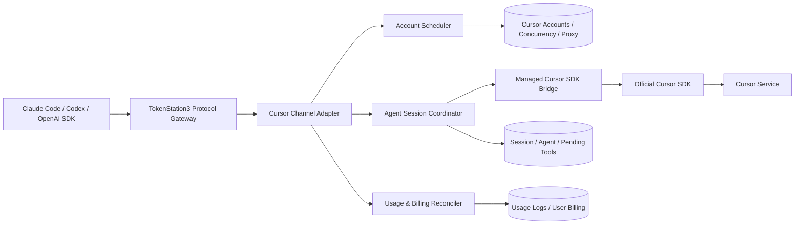

# Cursor 订阅渠道开源实现调研与 TokenStation3 集成建议

> 调研日期：2026-08-22<br>
> 调研范围：GitHub 上将 Cursor 账号或订阅能力转换为 OpenAI、Anthropic、Responses API 的开源实现，以及 One API、New API、CLIProxyAPI 类聚合网关中的 Cursor 渠道实现。<br>
> 数据说明：Star、Fork、项目状态和功能描述均为调研当日快照，后续可能变化。本文只引用项目仓库、源码、Issue、PR 和官方协议仓库等一手资料。

## 1. 执行摘要

本次调研得到四个核心结论：

1. **已经有人使用 Cursor 官方 SDK 或官方 SDK Bridge 实现 Cursor 订阅渠道。** 这类项目并不是逆向 Cursor 上游传输协议，而是在官方 Agent SDK 之外实现 OpenAI、Anthropic、Responses 协议转换、工具回调、会话续接、账号调度和计费适配。
2. **官方 SDK 路线尚未进入主流高 Star 网关的主线。** One API、New API 和 CLIProxyAPI 主仓库目前都没有正式合并 Cursor 订阅 provider。New API 曾出现完整的官方 SDK Cursor 渠道 PR，但维护者以“无计划”关闭。
3. **高 Star 项目的 Cursor 实现多数仍然使用私有协议。** OmniRoute、9router、CLIProxyAPIPlus 等项目直接调用 `api2.cursor.sh/agent.v1.AgentService/Run`，自己维护 HTTP/2 Connect、Protobuf、版本头、工具回调和会话状态。这些实现对账号池、会话和工具状态机很有参考价值，但传输层长期维护风险较高。
4. **TokenStation3 最合适的方案是“现有控制面 + 官方 SDK sidecar”。** 账号、并发、调度、用户鉴权、日志和计费继续复用 TokenStation3；新增 Cursor Channel Adapter、SDK Bridge 进程管理和 Agent Session Coordinator。首版不建议引入 Cookie、IDE PKCE、checksum 或私有 AgentService 作为正式数据面。

推荐组合不是直接复制某一个项目，而是分别借鉴：

- `cursor-sdk2api`：三协议转换、原生 custom tools、跨请求续接和冷恢复。
- New API Cursor PR：渠道集成边界、工具中间轮延迟计费和最终累计 usage 结算。
- `ccLoad`：Go 侧 Bridge 下载、SHA-256 校验、启动、探活、重启和模型发现。
- OmniRoute、CLIProxyAPIPlus：会话粘性、长连接工具状态机、TTL 和冷续接设计。
- TokenStation3：账号池、调度、并发、代理、用户计费和运营管理能力。

## 2. 术语和路线边界

项目名称中经常同时出现 “Cursor”“API”“Proxy”，但实际方向可能完全相反，需要先区分：

| 路线 | 上游调用方式 | 是否逆向 Cursor 传输 | 是否使用 Cursor 订阅 | 典型项目 |
| --- | --- | --- | --- | --- |
| 官方 SDK / SDK Bridge | `@cursor/sdk` 或 `sdk.v1` Bridge | 否 | 是 | cursor-sdk2api、ccLoad、New API Cursor fork |
| 私有 AgentService | 手写 HTTP/2 Connect + Protobuf 调用 `AgentService/Run` | 是 | 是 | OmniRoute、CLIProxyAPIPlus、9router |
| Cursor CLI 包装 | 启动 `cursor-agent`/`agent` 子进程并解析输出 | 不直接逆向协议 | 是 | cursorcli2api |
| Cursor Web Docs | 调用 Cursor 文档站点的免费对话接口 | 通常是非公开 Web 接口 | 否或不依赖付费订阅 | 7836246/cursor2api |
| Cursor BYOK | 模拟 Cursor 后端，让 Cursor 调用用户自己的模型 API | 逆向的是 Cursor 客户端入口 | 否，方向相反 | leookun/cursor-byok |

所谓“使用官方 SDK 做逆向”并不准确。官方路线的实际数据流是：

```text
下游客户端
  -> OpenAI / Anthropic / Responses 兼容层
  -> Cursor Agent 会话与工具协调层
  -> 官方 @cursor/sdk 或 sdk.v1 Bridge
  -> Cursor 服务
```

社区自行实现的是 SDK 之外的兼容层，而不是 Cursor SDK 到 Cursor 服务之间的传输协议。

## 3. 项目总览

### 3.1 重点项目

| 项目 | Star 快照 | License | Cursor 数据面 | 工具与会话 | 综合判断 |
| --- | ---: | --- | --- | --- | --- |
| [diegosouzapw/OmniRoute](https://github.com/diegosouzapw/OmniRoute) | 52,938 | MIT | 私有 AgentService | 跨 HTTP 工具续接、账号池、Cursor CLI 透传 | 私有路线中平台和会话能力最完整 |
| [router-for-me/CLIProxyAPI](https://github.com/router-for-me/CLIProxyAPI) | 48,328 | MIT | 主线无 Cursor provider | 不适用 | 高 Star 不等于已有 Cursor 支持 |
| [decolua/9router](https://github.com/decolua/9router) | 26,041 | MIT | 私有 AgentService/旧 ChatService | 工具能力较早期 | 可用于理解 OmniRoute 类实现的演进 |
| [kaitranntt/CLIProxyAPIPlus](https://github.com/kaitranntt/CLIProxyAPIPlus) | 231 | MIT | 私有 AgentService | 保留 H2 流、跨请求注回工具结果、冷恢复 | CLIProxyAPI 社区中最值得研究的 Cursor 实现 |
| [caidaoli/ccLoad](https://github.com/caidaoli/ccLoad) | 392 | MIT | 官方 SDK Bridge | 工具通过提示词标签模拟 | Bridge 生命周期和 Go 接入的最佳参考 |
| [Sunnyender-org/cursor-sdk2api](https://github.com/Sunnyender-org/cursor-sdk2api) | 18 | MIT | 官方 `@cursor/sdk` | 原生 customTools、三协议共享会话、冷恢复 | 与 TokenStation3 目标最接近的官方路线实现 |
| [Sunnyender-org/new-api Cursor fork](https://github.com/Sunnyender-org/new-api/tree/agent/cursor-agent-sdk-channel) | 0 | AGPL-3.0 | 官方 `@cursor/sdk` sidecar | 原生工具、多轮、粘性路由、延迟计费 | 完整渠道设计样本，但不宜直接复制 AGPL 代码 |
| [raine/claude-code-proxy](https://github.com/raine/claude-code-proxy) | 527 | MIT | 私有 AgentService | thinking、usage、图片；Read/Write/Bash 工具桥 | 私有实现中边界文档较清楚 |
| [standardagents/composer-api](https://github.com/standardagents/composer-api) | 322 | MIT | 本地 SDK/Bridge 路线 | Responses 工具有限，usage 估算 | 本地 sidecar 和政策风险参考 |
| [AmazingAng/auth2api](https://github.com/AmazingAng/auth2api) | 568 | 未声明 | 私有旧协议 | 多账号；Cursor 工具、图片尚未转换 | 账号池可参考，Cursor 数据面不适合复用 |
| [SJwen0/cursor--](https://github.com/SJwen0/cursor--) | 0 | LGPL-3.0 | 私有 AgentService | 复用 sub2api 平台能力 | 与本项目结构最接近，但正式传输不建议照搬 |

### 3.2 容易误判的项目

| 项目 | Star 快照 | 实际方向 | 判断 |
| --- | ---: | --- | --- |
| [7836246/cursor2api](https://github.com/7836246/cursor2api) | 1,883 | Cursor Web Docs 免费对话接口转 API | 不是 Cursor 订阅账号渠道；工具主要靠提示词与文本解析 |
| [Xchat1/cursor2api-go](https://github.com/Xchat1/cursor2api-go) | 1,066 | Cursor Web 接口 Go 实现 | 上游已明显退化，且许可证不清晰 |
| [leookun/cursor-byok](https://github.com/leookun/cursor-byok) | 2,441 | 让 Cursor IDE 使用用户自己的模型 API | 方向与“Cursor 订阅转 API”相反 |
| [Azhi-ss/cursorcli2api](https://github.com/Azhi-ss/cursorcli2api) | 71 | Cursor Agent CLI 子进程转 API | 可做快速 sidecar，但进程开销、CLI 输出和版本稳定性较弱 |
| [JiuZX/Cursor-To-OpenAI](https://github.com/JiuZX/Cursor-To-OpenAI) | 176 | Cursor Cookie + 旧 `StreamUnifiedChatWithTools` | 历史实现，不适合作为当前正式方案 |
| [zhx47/cursor-api](https://github.com/zhx47/cursor-api) | 268 | 旧 Cursor 私有 ChatService | 项目较旧且未声明许可证 |
| [AstroQore/cursor2api](https://github.com/AstroQore/cursor2api) | 9 | 私有 `agent.v1`，支持工具和多账号 | 实现紧凑但为 AGPL-3.0，适合研究而非直接复用 |
| [NGLSG/Cursor2API](https://github.com/NGLSG/Cursor2API) | 60 | 轻量 Cursor API 网关 | 与 composer-api 代码和路线接近，独立参考价值有限 |

## 4. 官方 SDK / SDK Bridge 路线分析

### 4.1 Cursor SDK Bridge

官方仓库：[cursor/sdk-bridge](https://github.com/cursor/sdk-bridge)

Cursor SDK Bridge 是公开的、MIT 许可的 `sdk.v1` 协议和本地 Bridge 实现。它在本地启动一个小型服务，内部加载 TypeScript Cursor SDK，并通过 Connect/gRPC-Web 暴露：

- 创建和恢复 Agent。
- 发送消息和消费流式 Run。
- 获取模型、身份、仓库和 usage。
- 自定义工具 callback。
- Agent store callback。
- artifacts 和结构化错误。

对于 Go 项目，它避免了在 Go 中直接依赖 TypeScript SDK，也避免手写 Cursor 私有 AgentService 协议。Go 侧只需要：

1. 固定 Bridge 版本并验证发行包哈希。
2. 启动 Bridge 并读取 ready 握手信息。
3. 通过 `sdk.v1` 生成的 Go Connect client 调用服务。
4. 实现自定义工具 callback service。
5. 负责进程退出、重启、代理环境和版本升级。

官方 Bridge 仓库为 MIT，并不自动代表 Cursor 订阅可以被公开转售或共享。SDK 软件许可证、Cursor 服务条款、账号使用范围和商业托管政策仍需分别确认。

### 4.2 cursor-sdk2api

仓库：[Sunnyender-org/cursor-sdk2api](https://github.com/Sunnyender-org/cursor-sdk2api)

这是当前与 TokenStation3 目标最接近的官方路线项目。它直接使用公开的 `@cursor/sdk`，并暴露：

- `POST /v1/messages`
- `POST /v1/chat/completions`
- `POST /v1/responses`
- `GET /v1/models`
- 账号导入、模型目录、套餐 usage 和本地管理台

核心设计包括：

- 三种下游协议共享同一个 Run Coordinator，而不是各写一套工具和会话逻辑。
- 将请求中的客户端工具转换为 SDK `local.customTools`，通过 MCP/custom tool callback 让 Cursor harness 选择工具。
- 禁用 Cursor 自带的 shell、read、edit、task、webSearch 和 webFetch，避免工具在网关宿主机执行。
- 工具由 Claude Code、Codex 或其他外层客户端在自己的工作目录执行。
- 普通线性多轮请求恢复同一个 Cursor Agent，只发送新的用户回合。
- session、SDK agent、凭据指纹、模型、effort、pending tool id 和 transcript digest 绑定。
- 原进程或原会话丢失时，可根据完整 transcript 冷重建；历史已执行工具通过签名匹配返回已有结果，避免副作用重复执行。
- 多账号模式下，新会话按模型感知轮询；已有会话固定原账号。
- 只有在尚未输出语义内容时，才允许因鉴权、权限、限流或超时切换备用账号。

主要风险：

- 项目很新，Star 和独立生产验证有限。
- v0.1 管理面按可信单进程 sidecar 设计，公网部署需要额外鉴权和网络隔离。
- `previous_response_id`、OpenAI stored responses、background responses 和 hosted tools 尚不支持。
- README 声明的测试和 live smoke 证据属于项目自身报告，本次调研未使用真实 Cursor 账号独立复现。

### 4.3 New API 官方 SDK Cursor 渠道 fork

- 上游 PR：[QuantumNous/new-api#6869](https://github.com/QuantumNous/new-api/pull/6869)
- 代码分支：[Sunnyender-org/new-api/agent/cursor-agent-sdk-channel](https://github.com/Sunnyender-org/new-api/tree/agent/cursor-agent-sdk-channel)

该 PR 曾尝试把 Cursor 作为 New API 原生渠道类型接入。变更规模为 74 个文件、约 9,568 行新增，包含：

- Cursor Agent 渠道类型、管理台和账号信息。
- 内置 Node.js SDK sidecar 和 Docker 启动编排。
- Messages、Chat Completions、Responses 转换。
- 原生工具调用、并行工具和跨 HTTP `tool_result` 续接。
- 多租户 session 绑定、并发限制、粘性路由和可选 peer forwarding。
- 本地 `count_tokens` 估算。
- 模型目录、账号套餐和 Dashboard usage 查询。
- 工具中间轮延迟计费，最终根据 SDK 累计 usage 结算。

这套计费思路值得 TokenStation3 借鉴：

```text
第一个请求返回 tool_use
  -> 保存累计 usage 和 pending tool 状态
  -> 不进行最终结算

客户端执行工具并提交 tool_result
  -> 恢复同一 Cursor Agent
  -> 获取新的累计 usage

最终响应结束
  -> 以累计 usage 增量或最终累计值完成一次幂等结算
```

PR 同时记录了 SDK 参数边界：SDK 不直接暴露原始 `max_tokens`、`temperature`、`top_p` 和 stop sequence，这些由 Cursor harness 管理；可以映射的是 SDK 明确支持的 model 和 effort。该 PR 最终被 New API 维护者以“无计划”关闭，未进入主线。

该 fork 继承 New API 的 AGPL-3.0。可以分析其架构、接口和行为，但直接复制代码进入不同许可证项目之前必须进行许可证评估。相同作者后续拆出的 `cursor-sdk2api` 为 MIT，更适合复用。

### 4.4 ccLoad

仓库：[caidaoli/ccLoad](https://github.com/caidaoli/ccLoad)

`ccLoad` 是 Go 实现的多渠道 API 网关，已经正式提供 Cursor User API Key 渠道。值得借鉴的部分是完整的 Bridge 运维能力：

- 检测已有 `cursor-sdk-bridge`。
- 下载固定版本的官方发行包。
- 校验内置 SHA-256。
- 原子安装到受控状态目录。
- 支持 `CURSOR_SDK_BRIDGE_BIN` 离线覆盖。
- 校验 Bridge ready 握手只监听 loopback。
- 监测意外退出并自动重启。
- 使用 Bridge `ListModels` 获取精确模型 ID。
- 读取 SDK Run usage 和 Cursor Dashboard usage 窗口。

它的主要不足是客户端工具没有映射为 SDK 原生 `customTools`。项目将工具目录写进 prompt，要求模型输出：

```xml
<cc_tool_call>
{"name":"bash","arguments":{"cmd":"..."}}
</cc_tool_call>
```

网关再将标签解析成 Anthropic `tool_use` 或 OpenAI `tool_calls`。这种方式实现简单，并且不会在宿主机执行工具，但模型遵循程度、并行工具、工具 schema、结果绑定和恢复可靠性均弱于原生 custom tool callback。

因此建议只复用它的 Bridge 进程管理、Go client、usage 获取和安全检查，不把提示词工具协议作为 TokenStation3 最终实现。

### 4.5 composer-api

仓库：[standardagents/composer-api](https://github.com/standardagents/composer-api)

该项目提供本地 OpenAI Chat Completions 和 Responses API，主要服务 Composer、Grok 等 Cursor 模型。其生产方向从 hosted API 调整为签名 macOS 本地应用：Cursor 曾要求项目下线托管 API 路径，因此正式发布让 Cursor User API Key 保存在用户本机。

已知边界：

- 支持文字、图片、流式和非流式返回。
- Responses function/tool calls 被明确拒绝。
- 不支持 `n > 1`、logprobs、audio 和 background responses。
- token usage 主要按字符估算，cost 也按公开价格估算。

它的最大参考价值不是协议完整度，而是部署与政策信号：个人本地 sidecar 或用户自带凭据比公开托管共享账号池风险低。TokenStation3 若提供中心化 Cursor 渠道，需要在正式开发前确认服务条款和运营边界。

## 5. 私有 AgentService 路线分析

### 5.1 OmniRoute

- 仓库：[diegosouzapw/OmniRoute](https://github.com/diegosouzapw/OmniRoute)
- Cursor 文档：[CURSOR-API-KEY-AND-CLI.md](https://github.com/diegosouzapw/OmniRoute/blob/release/v3.8.50/docs/providers/CURSOR-API-KEY-AND-CLI.md)
- 会话管理：[cursorSessionManager.ts](https://github.com/diegosouzapw/OmniRoute/blob/release/v3.8.50/open-sse/services/cursorSessionManager.ts)

OmniRoute 同时维护两类 Cursor provider：

- `cursor`：IDE OAuth/本地 Cursor session 路线。
- `cursor-api`：录入 Dashboard 生成的 `crsr_` User API Key。

原始 `crsr_` key 不能直接作为 `api2.cursor.sh` Bearer token，因此项目调用 `/auth/exchange_user_api_key` 换取约一小时 session JWT，按 key 缓存，并在过期前重新交换。随后直接打开私有 `AgentService/Run` HTTP/2 双向流。

OmniRoute 还实现 Cursor CLI passthrough：Cursor CLI 使用 OmniRoute key 登录，OmniRoute 签发自己的短期 JWT、选择 Cursor 账号、替换上游认证并透传 CLI RPC。

工具续接是其最值得参考的部分：

1. OpenAI 工具被转换成 Cursor MCP tool definitions。
2. Cursor 发出 MCP call 后，下游先收到标准 `tool_call`。
3. 原 H2 流保存在内存 session manager 中。
4. 下一次 HTTP 请求携带 `tool_result` 和 tool call id。
5. 网关找到原 H2 流，发送 `McpResult`，继续消费模型输出。
6. session 过期或多实例未命中时，用完整历史做 cold resume。

- 可借鉴：账号渠道定义、User API Key 交换、session TTL、最大 session 数、工具 pending 状态、Cursor CLI 透传和日志归属。
- 不建议复用：私有 AgentService Protobuf、客户端版本伪装和手写传输层。

### 5.2 CLIProxyAPIPlus

- 仓库：[kaitranntt/CLIProxyAPIPlus](https://github.com/kaitranntt/CLIProxyAPIPlus)
- Cursor executor：[cursor_executor.go](https://github.com/kaitranntt/CLIProxyAPIPlus/blob/main/internal/runtime/executor/cursor_executor.go)

CLIProxyAPI 主线没有 Cursor provider，但 CLIProxyAPIPlus 维护了完整的社区实现。它同样调用私有 `AgentService/Run`，其状态机包括：

- Cursor OAuth/账号 token 管理。
- 动态模型目录缓存。
- OpenAI tools 到 MCP tool definitions。
- thinking 到 `reasoning_content`。
- streaming 和 non-streaming 输出。
- 保留原 H2 流等待下一次 HTTP 工具结果。
- 根据 session、账号和 conversation id 隔离会话。
- session 丢失时将工具历史扁平化做 cold continuation。
- H2 idle timeout、flow-control timeout、checkpoint 缓存和 usage reporter。

其核心流程为：

```text
请求 1
  -> 打开 AgentService/Run H2 流
  -> 收到 MCP tool call
  -> 返回 OpenAI/Anthropic tool call
  -> 原 goroutine 阻塞等待 toolResultCh

请求 2
  -> 查找相同 session 和 pending tool id
  -> 将 tool result 写入 toolResultCh
  -> 原 goroutine 向同一 H2 流写入 MCP result
  -> 切换输出 channel，将后续内容返回给请求 2
```

这套实现对 TokenStation3 的 Session Coordinator 很有参考价值，尤其是跨两个 HTTP 请求继续同一上游 Agent turn。但它要求实例粘性，进程重启会丢失 live Promise/channel，只能依赖 checkpoint 或冷恢复。

### 5.3 9router

仓库：[decolua/9router](https://github.com/decolua/9router)

9router 的 provider-agnostic 转换管线支持特殊 binary/protobuf executor。Cursor executor 从本地 Cursor `state.vscdb` 导入 access token 和 machine id，并构造 Cursor 版本、checksum 等私有请求头。

该项目同时出现过旧 `StreamUnifiedChatWithTools` 和较新的 `AgentService/Run` 路线。AgentService thinking 因缺少原生供应商签名而存在兼容限制，工具协议也比 OmniRoute 和 CLIProxyAPIPlus 更早期。

它适合用于理解私有 Cursor provider 如何嵌入通用网关 executor/translator 管线，但不应作为正式传输层基线。此外调研时仓库存在已公开的管理 API 安全公告，任何借鉴都必须重新审计管理端鉴权和凭据保护。

### 5.4 claude-code-proxy

- 仓库：[raine/claude-code-proxy](https://github.com/raine/claude-code-proxy)
- Cursor 文档：[cursor-agent.md](https://github.com/raine/claude-code-proxy/blob/main/docs/src/content/docs/providers/cursor-agent.md)

这是 Rust 实现的本地 Anthropic-compatible proxy，支持 ChatGPT、Kimi、Grok、OpenCode Go 和 Cursor 订阅。Cursor provider：

- 直接调用私有 `AgentService/Run`。
- 从已安装 Cursor Agent 的 `index.js` bundle 加载/发现生成的 Protobuf classes，但不通过 CLI 子进程执行推理。
- 支持动态模型目录和 Agent、Plan、Ask 模式。
- 将 Claude Code effort 映射到 Cursor 模型变体。
- 转换文字、thinking、usage 和图片。
- 只对 Read、Write、Bash 提供明确的工具桥；其他 workspace callback 未通用化。
- session 和 Cursor conversation id 映射保存在内存，重启后丢失。

该项目适合参考 effort/model alias、Anthropic SSE framing 和有限内置工具映射，不适合作为完整通用工具方案。

### 5.5 auth2api

仓库：[AmazingAng/auth2api](https://github.com/AmazingAng/auth2api)

auth2api 是轻量 OAuth-to-API proxy，支持 Claude、ChatGPT/Codex 和实验性 Cursor 登录。它有多账号、粘性路由、cooldown、自动 failover 和基本统计，但 Cursor 部分使用非公开、逆向的 Connect/Protobuf API。

项目文档明确说明 Cursor 工具、图片、repository context、edit actions 和更完整的 Agent protocol 尚未转换，当前更接近单轮流式文本。仓库未声明许可证，因此即使部分账号池代码可读，也不应直接复制到 TokenStation3。

### 5.6 SJwen0/cursor--

仓库：[SJwen0/cursor--](https://github.com/SJwen0/cursor--)

这是直接基于 sub2api 增加 Cursor 中转的平台 fork，能够复用：

- provider/channel 枚举。
- Cursor 账号数据库字段。
- 管理台和账号操作入口。
- 账号调度、并发、粘性会话和计费框架。

其上游传输采用 Cookie/PKCE、checksum、machine id 和私有 AgentService 等实现。对 TokenStation3 最有价值的是“平台接入清单”和 sub2api 结构对应关系，而不是传输代码。推荐保留其控制面思路，将数据面替换为官方 SDK Bridge。

## 6. 其他路线及排除原因

### 6.1 Cursor CLI 子进程包装

[Azhi-ss/cursorcli2api](https://github.com/Azhi-ss/cursorcli2api) 将 Cursor Agent CLI 包装成 OpenAI/Anthropic HTTP API。这种方案可以最快验证账号、模型和基本输出，但存在：

- 每请求或每会话子进程成本。
- CLI 输出格式变化风险。
- 取消、超时、并发和进程清理复杂。
- usage、工具回调和 session 恢复不一定有稳定结构化接口。
- 未声明许可证。

可作为开发期诊断或 smoke 工具，不建议成为正式数据面。

### 6.2 Cursor Web Docs 免费接口

[7836246/cursor2api](https://github.com/7836246/cursor2api) 和若干 Go fork 调用 Cursor 文档页的免费 AI 对话接口。它们与 Cursor User API Key 账号池没有直接关系，并通过 prompt injection、XML/JSON 文本解析模拟工具。项目自己记录了模型退化、文档助手身份限制、截断和上游不可用问题。

这类项目的高 Star 反映了免费接口需求，不代表其适合订阅渠道。TokenStation3 应明确排除该路线。

### 6.3 Cursor BYOK

[leookun/cursor-byok](https://github.com/leookun/cursor-byok) 模拟 Cursor 后端，让 Cursor IDE Agent 使用用户配置的 OpenAI/Anthropic API。它在 Cursor 工具协调和 BYOK 兼容方面有价值，但数据流方向与本任务相反：

```text
cursor-byok：Cursor IDE -> 用户自有模型 API
本任务：     Claude Code/Codex -> Cursor 订阅
```

因此不作为 Cursor 订阅 provider 候选。

### 6.4 旧 Cookie / ChatService 项目

`JiuZX/Cursor-To-OpenAI`、`zhx47/cursor-api` 等项目依赖 Cursor 客户端 Cookie、WorkOS session 和旧 `ChatService/StreamUnifiedChatWithTools`。它们适合用于历史协议研究，不适合当前长期实现。

## 7. TokenStation3 推荐架构

### 7.1 总体结构



控制面继续复用 TokenStation3：

- 用户 API key 和权限。
- Cursor provider/channel 枚举。
- 账号存储、加密和禁用状态。
- 调度、优先级、并发和 cooldown。
- 每账号代理配置。
- 请求日志、用户余额和管理台。

新增的数据面：

- Cursor SDK Bridge 进程管理器。
- `sdk.v1` Go Connect client。
- Chat、Messages、Responses 到 Cursor Agent 的统一转换。
- Agent Session Coordinator。
- Custom Tool Callback Adapter。
- Cursor SDK usage 到现有计费记录的 reconciliation。

### 7.2 凭据与账号模型

首版只支持 Cursor Dashboard User API Key，例如 `crsr_...`，不导入 IDE Cookie、WorkOS Cookie、machine id 或本地 `state.vscdb`。

建议每个 Cursor 账号至少记录：

- 加密 User API Key。
- Cursor identity、套餐类型和可用模型快照。
- included/API/Auto usage 窗口。
- 独立代理配置和最近验证出口。
- 并发上限、当前活动 Agent 数。
- 最近成功、鉴权失败、限流和 cooldown 状态。
- Bridge/SDK 版本兼容状态。

密钥不得返回给普通客户端，也不得出现在请求日志、错误详情或 sidecar stdout/stderr 中。

### 7.3 Session Coordinator

Cursor SDK 暴露的是有状态 Agent，而普通 Chat/Responses API 常被客户端按多个 HTTP 请求使用。建议 session 状态至少包含：

| 字段 | 用途 |
| --- | --- |
| downstream session id | 识别 Claude Code/Codex 会话 |
| Cursor account id | 保证同一会话账号粘性 |
| SDK agent id/store partition | 恢复 Cursor Agent |
| model + effort | 防止不兼容的跨模型续接 |
| tool catalog digest | 防止工具定义变化后错误恢复 |
| pending tool ids | 验证下一批 tool results |
| transcript/assistant anchor digest | 判断线性续接、fork 或 compact |
| last cumulative usage | 计算增量并避免重复计费 |
| state + expiry | running、waiting_tool、completed、lost |

普通线性 follow-up 优先恢复原 Agent，只发送新用户回合。遇到以下情况应冷重建或拒绝，而不是盲目恢复：

- model/effort 改变。
- tool catalog 改变。
- transcript fork。
- 原账号不可用。
- pending tool id 与提交结果不一致。
- session 已被另一个并发请求占用。

多实例部署至少需要一种保证：

1. load balancer 对 session id 做粘性路由；或
2. session owner registry + 实例间转发；或
3. 每次请求都携带足够 transcript，允许安全冷恢复。

首版推荐“粘性路由 + 完整 transcript 冷恢复”，暂不实现复杂 peer forwarding。

### 7.4 工具调用

工具应采用 SDK 原生 custom tool callback，而不是 prompt 标签模拟：

1. 将 OpenAI/Anthropic 工具 schema 规范化。
2. 注册为 SDK `local.customTools`。
3. 禁用 Cursor ambient shell、read、edit、task、webSearch 和 webFetch。
4. Cursor harness 选择工具后，Bridge callback 到 TokenStation3/sidecar。
5. 网关返回下游协议的 `tool_call`/`tool_use`。
6. 下游客户端在自己的 workspace 执行工具。
7. 下一次 HTTP 请求提交 tool result。
8. Session Coordinator 匹配 tool id 并恢复 callback/Agent。

必须处理：

- 并行工具批次。
- 同名工具和 schema digest。
- tool id 在 Chat、Messages、Responses 之间的稳定映射。
- 重试和冷恢复时避免重复执行有副作用工具。
- callback timeout 和客户端断开。
- 进程重启后 live Promise 不可序列化的问题。

### 7.5 Thinking 与请求参数

Cursor SDK 是 Agent API，不是底层模型原始 API，因此不能承诺所有下游参数一一生效。

建议兼容策略：

- `reasoning_effort`、Anthropic thinking 档位映射到 Cursor 支持的 effort/model variants。
- SDK 明确返回的 thinking/reasoning event 转换为下游 thinking block 或 `reasoning_content`。
- 不伪造不存在的签名或 encrypted reasoning 内容。
- `max_tokens`、`temperature`、`top_p`、stop sequences 若 SDK 不支持，应明确忽略、拒绝或记录兼容告警，不得假装已透传。
- 模型目录以 SDK 实时 `ListModels` 为准，不合成未经 Cursor 返回的 thinking 模型。

### 7.6 Usage 与计费

SDK Run usage 可能在多轮工具调用中以累计值出现，不能把每个 HTTP 工具回合都当成独立完整模型调用扣费。

推荐模型：

```text
session.last_cumulative_usage = 上一次已记录的 SDK 累计 usage
current_cumulative_usage      = 本次 SDK 返回的累计 usage
billable_delta                = max(current - last, 0)
```

处理规则：

- 每次 SDK usage event 先写幂等 attempt/turn usage。
- 工具中间轮记录 pending usage，不做重复最终结算。
- 最终完成时按累计 usage 增量结算。
- session 冷恢复产生新 Agent 时建立新的 usage generation，不能和旧累计值直接相减。
- retry 只有在没有语义输出时才能换账号；不同账号 usage 分开归属。
- SDK usage 缺失时标记 accounting degraded，不能静默用估算值冒充精确 usage。
- 如业务需要预扣额度，可预留最大风险额度，最终按真实 usage 释放差额。

现有 TokenStation3 thinking、cache read/write、reasoning token 字段应逐项与 SDK usage 实测对齐，不能仅根据字段名称假定语义相同。

### 7.7 调度、并发和故障转移

Cursor Agent 会话比普通无状态 HTTP 请求占用更长资源。调度需要区分：

- 新 session：可按健康度、模型、配额和并发选择账号。
- 已有 session：优先固定原账号。
- waiting_tool：仍占用逻辑 session；是否占用上游 Run/并发取决于 SDK callback 实现。
- 输出前失败：允许同账号重建，必要时切一个兼容账号。
- 已输出文本、thinking 或 tool call 后失败：禁止透明切账号继续同一响应，避免重复输出和上下文分叉。

账号 cooldown 应区分鉴权失败、模型权限、429、套餐耗尽、网络代理失败和 Bridge 本地错误，不能把本地 sidecar 故障错误归因到 Cursor 账号。

### 7.8 安全与代理

- Bridge 只监听 loopback，并使用随机短期控制 token。
- 校验 ready URL 必须为 literal loopback address。
- Bridge 版本固定，发行包校验 SHA-256，更新采用原子替换。
- SDK workspace 使用隔离的空目录，默认禁用宿主机工具。
- 每账号请求和控制面调用必须复用 TokenStation3 配置的代理链路。
- 子进程正确继承 `HTTP_PROXY`、`HTTPS_PROXY`、`NO_PROXY`，同时避免代理 Bridge 本机回环 RPC。
- Cursor key、session token、工具输入输出和完整 prompt 的日志级别分别控制。
- 管理 API 必须复用现有管理员鉴权，禁止像部分社区项目那样默认公开 provider CRUD。
- 公网部署需限制 sidecar 管理端和内部 callback 服务的访问来源。

## 8. 推荐实施阶段

### 阶段 0：可行性与政策确认

- 固定官方 Bridge 版本和平台支持矩阵。
- 确认 Bridge、SDK 及发行包分发许可。
- 确认 Cursor User API Key、订阅账号和中心化网关的服务条款边界。
- 使用专用测试账号和现有代理链路完成官方 Bridge smoke test。
- 验证模型目录、identity、usage、thinking 和 effort 实际返回。

### 阶段 1：Bridge 与账号控制面

- 新增 Cursor provider 和 User API Key 账号类型。
- 实现 Bridge 下载、哈希校验、启动、探活和重启。
- 实现 identity、models 和套餐 usage 查询。
- 接入现有代理、账号健康和管理台。

### 阶段 2：纯文本三协议

- 建立统一内部消息结构。
- 接入 Anthropic Messages、OpenAI Chat Completions 和 Responses。
- 支持 streaming/non-streaming、thinking 和基础 usage。
- 明确记录不支持的原始模型参数。

### 阶段 3：原生工具和 Session Coordinator

- 注册 SDK custom tools。
- 实现并行工具和跨 HTTP `tool_result`。
- 实现 session/account 粘性、digest 校验、TTL 和并发冲突。
- 实现进程重启后的安全冷恢复和工具副作用去重。

### 阶段 4：计费和生产调度

- 对齐 SDK usage 字段。
- 实现累计 usage 增量和工具中间轮延迟结算。
- 接入用户余额、渠道倍率、成本和 usage logs。
- 完成输出前重试、账号 cooldown 和模型感知调度。

### 阶段 5：生产加固

- 多实例粘性路由和 session owner 观测。
- Bridge 资源限额、熔断、drain 和优雅退出。
- 密钥脱敏、日志分级和管理端安全测试。
- 账号级代理一致性和出口泄漏测试。
- live smoke、长工具链、断线恢复、重复请求和计费幂等验收。

## 9. 建议的首版验收标准

首版只有同时满足以下条件，才应被认为能够作为 TokenStation3 正式 Cursor 渠道：

- 仅使用官方 SDK/SDK Bridge 调用 Cursor 推理。
- User API Key 不暴露给下游用户和日志。
- Messages、Chat Completions、Responses 至少各有流式文本真实调用验收。
- thinking/effort 行为有真实模型对照，不伪造不支持参数。
- Claude Code 和 Codex 各完成至少两轮真实工具调用。
- 并行工具结果能按 tool id 正确续接。
- 同 session 固定 Cursor 账号，输出后不会透明切账号。
- Bridge 重启后可以明确失败或安全冷恢复，不会重复执行工具副作用。
- SDK usage 与 Cursor Dashboard 变化完成抽样核对。
- 工具中间轮、最终轮、重试和冷恢复均通过计费幂等测试。
- 所有上游调用走账号配置代理，未发现宿主机直连泄漏。
- 多账号并发、限流、账号失效和套餐耗尽进入正确 cooldown。

## 10. 最终建议

建议正式决策如下：

1. **主数据面选择官方 Cursor SDK Bridge。**
2. **TokenStation3 内新增 Cursor Channel Adapter 和 Agent Session Coordinator。**
3. **控制面复用现有 sub2api/Kiro 账号、调度、并发、日志和计费体系。**
4. **工具采用 SDK 原生 custom tools，不使用 XML 标签或 prompt 模拟作为正式实现。**
5. **首版不实现私有 AgentService fallback。** 私有实现只用于阅读和对比；否则会同时维护官方与逆向两套复杂状态机。
6. **首版不支持 IDE Cookie、WorkOS Cookie 和 `state.vscdb` 导入。** 只支持 Cursor Dashboard User API Key。
7. **计费采用 SDK 累计 usage reconciliation，工具中间轮延迟结算。**
8. **在开发前单独完成 Cursor 服务条款和中心化托管边界确认。** 开源项目的 MIT/LGPL 许可证不等于拥有转售订阅能力。

综合来看，社区已经证明 Cursor 订阅渠道可以通过官方 SDK 实现，并且 New API fork、cursor-sdk2api 和 ccLoad 已分别覆盖渠道集成、工具会话与 Bridge 运维三个关键部分。TokenStation3 不需要重新逆向 Cursor 上游协议，但仍需认真实现 Agent API 与普通模型 API 之间的状态、工具、usage 和计费适配。

## 11. 主要资料链接

### 官方路线

- [Cursor SDK Bridge](https://github.com/cursor/sdk-bridge)
- [cursor-sdk2api](https://github.com/Sunnyender-org/cursor-sdk2api)
- [cursor-sdk2api Architecture](https://github.com/Sunnyender-org/cursor-sdk2api/blob/main/docs/ARCHITECTURE.md)
- [cursor-sdk2api New API Integration](https://github.com/Sunnyender-org/cursor-sdk2api/blob/main/docs/NEW_API_INTEGRATION.md)
- [New API PR #6869](https://github.com/QuantumNous/new-api/pull/6869)
- [New API Cursor fork branch](https://github.com/Sunnyender-org/new-api/tree/agent/cursor-agent-sdk-channel)
- [ccLoad](https://github.com/caidaoli/ccLoad)
- [composer-api](https://github.com/standardagents/composer-api)

### 私有协议与平台参考

- [OmniRoute](https://github.com/diegosouzapw/OmniRoute)
- [OmniRoute Cursor API Key and CLI](https://github.com/diegosouzapw/OmniRoute/blob/release/v3.8.50/docs/providers/CURSOR-API-KEY-AND-CLI.md)
- [OmniRoute Cursor Session Manager](https://github.com/diegosouzapw/OmniRoute/blob/release/v3.8.50/open-sse/services/cursorSessionManager.ts)
- [CLIProxyAPI](https://github.com/router-for-me/CLIProxyAPI)
- [CLIProxyAPIPlus](https://github.com/kaitranntt/CLIProxyAPIPlus)
- [CLIProxyAPIPlus Cursor Executor](https://github.com/kaitranntt/CLIProxyAPIPlus/blob/main/internal/runtime/executor/cursor_executor.go)
- [9router](https://github.com/decolua/9router)
- [claude-code-proxy](https://github.com/raine/claude-code-proxy)
- [claude-code-proxy Cursor Agent documentation](https://github.com/raine/claude-code-proxy/blob/main/docs/src/content/docs/providers/cursor-agent.md)
- [auth2api](https://github.com/AmazingAng/auth2api)
- [SJwen0/cursor--](https://github.com/SJwen0/cursor--)

### 排除与历史路线

- [7836246/cursor2api](https://github.com/7836246/cursor2api)
- [Xchat1/cursor2api-go](https://github.com/Xchat1/cursor2api-go)
- [leookun/cursor-byok](https://github.com/leookun/cursor-byok)
- [Azhi-ss/cursorcli2api](https://github.com/Azhi-ss/cursorcli2api)
- [JiuZX/Cursor-To-OpenAI](https://github.com/JiuZX/Cursor-To-OpenAI)
- [zhx47/cursor-api](https://github.com/zhx47/cursor-api)
- [AstroQore/cursor2api](https://github.com/AstroQore/cursor2api)
- [NGLSG/Cursor2API](https://github.com/NGLSG/Cursor2API)
